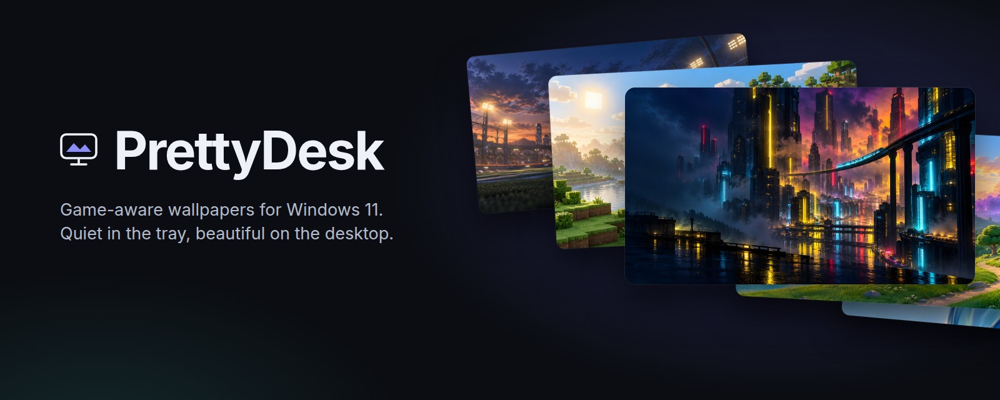
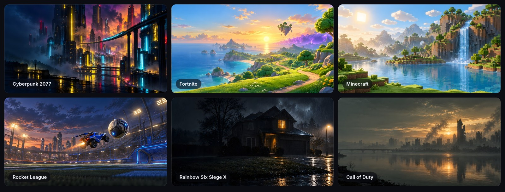
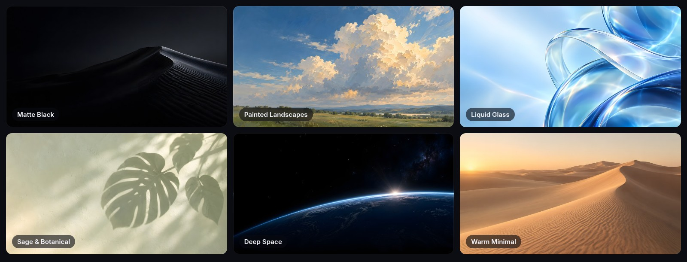
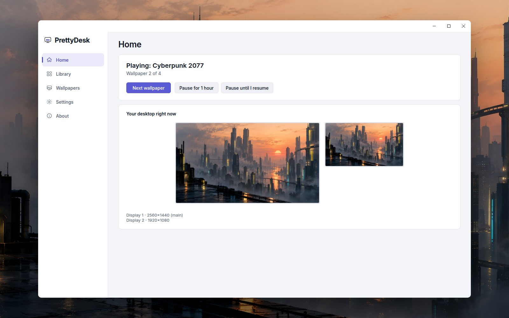
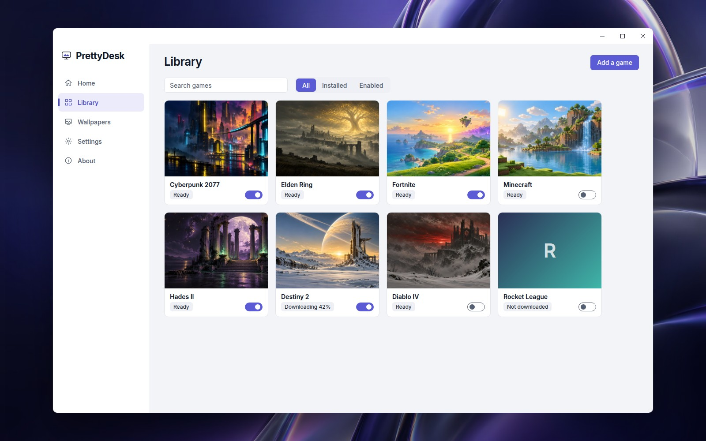
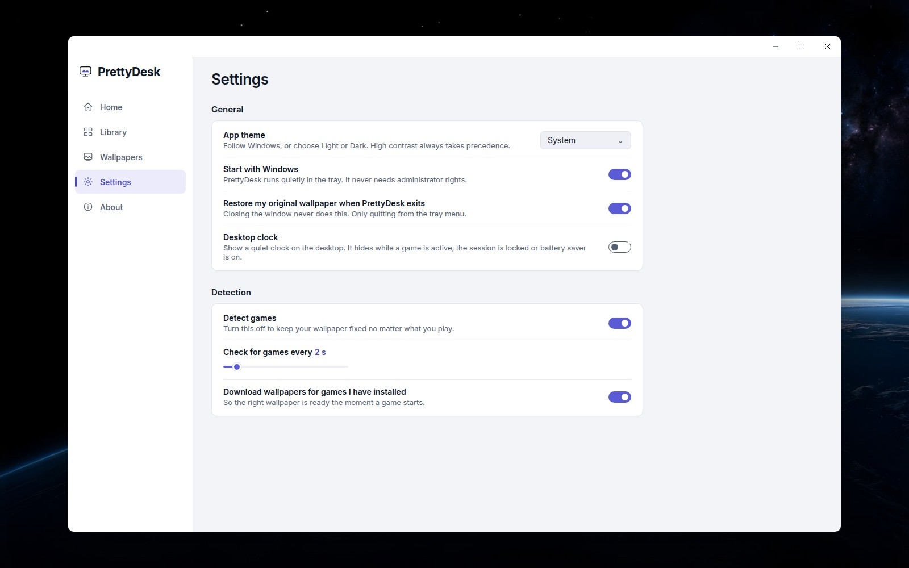
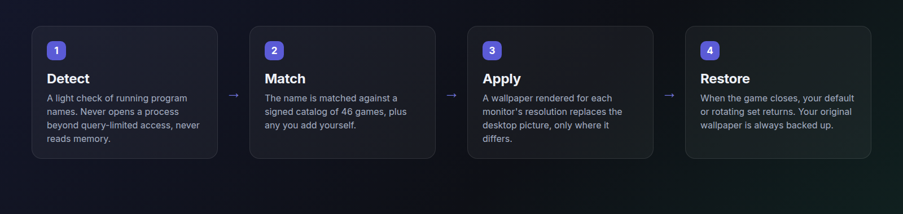

<div align="center">



<br>

[](https://github.com/CBaileyDev/PrettyDesk/actions/workflows/ci.yml)


**[Features](#features) · [Interface](#interface) · [How it works](#how-it-works) · [Privacy](#privacy) · [Build](#build-test-check) · [Docs](#documentation)**

</div>

<br>

PrettyDesk changes your Windows 11 wallpaper to game-inspired art while you play, then goes back to your clean default (or a rotating
set) when you stop. It lives in the tray, needs no admin rights, and keeps your game activity on your machine.

> [!NOTE]
> **Pre-release.** All 14 default collections have bundled offline wallpapers and thumbnails. Game artwork and renditions are still
> incomplete; the dated coverage is in [`art/GENERATION_STATUS.json`](art/GENERATION_STATUS.json). The content host is not configured, so
> remote game packs cannot download in the EXE yet; the bundled defaults, including Tide, Bloom and Dusk, work offline.
> A signed HTTPS test catalog and a real x64 install, update and uninstall restore have passed locally. An unsigned local x64 beta
> installer and portable ZIP exist. Public hosting, production signing, the interrupted 24-hour soak and the wider hardware QA matrix
> are still open: see [`docs/PERF.md`](docs/PERF.md), [`docs/QA_CHECKLIST.md`](docs/QA_CHECKLIST.md) and [`docs/BACKLOG.md`](docs/BACKLOG.md).

## Features

| | |
|---|---|
| **Game-aware** | Rules for 46 games. A running game selects its wallpaper; when it exits, your default returns. Add your own games in a few clicks. A configured signed feed can update rules without an app update. Exe names and AppIDs still need broader real-install verification ([backlog](docs/BACKLOG.md)). |
| **Made for clean setups** | 14 default collections: Matte Black, Clean White, Warm Minimal, Sage and Botanical, Aura Gradients, Misty Nature, Painted Landscapes, Steel Blue Night, Cozy Lo-fi, Deep Space, Pastel Dream, Neon Minimal, Architecture and Light, and the original Liquid Glass set. Every game is planned to get a **minimal** wallpaper so the vibe survives while you play. |
| **Only dark wallpapers** | One switch keeps rotation, game pages, fixed-wallpaper choices and the picker to dark art. Your own images are measured once and judged the same way ([ADR 0015](docs/adr/0015-dark-only-and-user-image-tone.md)). |
| **Per-monitor rendering** | Each monitor gets an image rendered at its own resolution from the closest aspect ratio (16:9, 16:10, 3:2, 21:9, 32:9, portrait), cropped around the art's focal point. The broader mixed-DPI and hardware matrix remains in QA. |
| **Invisible** | A small tray app that survives sleep, lock, Explorer restarts and display changes. Restore handles pictures, solid colours and saved slideshow sources and timing, also on uninstall. Windows Spotlight is preserved by asking you to pick Picture or Slideshow first. Idle CPU and memory targets: [`docs/PERF.md`](docs/PERF.md). |
| **Non-invasive detection** | Reads process names and PIDs plus limited candidate path and window-title details. Never opens a process with more than `PROCESS_QUERY_LIMITED_INFORMATION`, never reads memory, never injects or hooks another process. Source-guard tests enforce this in the test gate. |

### The art





<sub>Original art inspired by each game; PrettyDesk is not affiliated with any game publisher. Every image above is a bundled starter wallpaper from [`content/starter`](content/README.md).</sub>

## Interface

A flush sidebar, solid cards and one indigo accent, in light, dark and Windows high-contrast palettes. No blur, no transparency
([ADR 0016](docs/adr/0016-dashboard-visual-language.md)).

<picture>
  <source media="(prefers-color-scheme: dark)" srcset="docs/images/ui-home-dark.jpg">
  
</picture>

<table>
<tr>
<td width="50%">
<picture>
  <source media="(prefers-color-scheme: dark)" srcset="docs/images/ui-library-dark.jpg">
  
</picture>
</td>
<td width="50%">
<picture>
  <source media="(prefers-color-scheme: dark)" srcset="docs/images/ui-settings-dark.jpg">
  
</picture>
</td>
</tr>
</table>

<sub>These are design renders, not captures of the running app: they are built by [`tools/readme-assets`](tools/readme-assets/build.py) from the app's own
resource strings, colour palettes and layout. They switch with your GitHub theme. Real Windows captures will replace them after the visual QA pass.</sub>

## How it works



PrettyDesk applies only the differences, never more than once per monitor every two seconds, and snapshots your original
wallpaper before the first change so **Restore my original wallpaper** always works. The state machine is specified in
[`docs/SPEC.md`](docs/SPEC.md) (section 5.4); code ownership is in [`docs/ARCHITECTURE.md`](docs/ARCHITECTURE.md).

## Privacy

- **No telemetry, no accounts, no analytics.** Nothing about you or your games is ever sent.
- The running-process list never leaves your machine and is never written to disk. Logs only contain matched game ids and have your user name removed.
- The only network traffic is fetching the signed wallpaper catalog and wallpaper packs from the content host, and checking GitHub
  Releases for updates. Requests carry the app version in the User-Agent and nothing else.
- Everything lives under `%LOCALAPPDATA%\PrettyDesk` (settings, downloaded packs, your images, your original-wallpaper backup, logs).
  Uninstalling asks whether to delete it.

## Local beta packages

The current x64 outputs are under `dist/releases/1.0.0-beta.1/win-x64`:
`PrettyDeskApp-win-x64-beta-Setup.exe` and `PrettyDeskApp-win-x64-beta-Portable.zip`. The installer is per-user and the packages are
unsigned. This build does not establish a public signed release, a working remote wallpaper host, or ARM64 runtime validation.
See [RELEASING](docs/RELEASING.md) to build the next beta and verify install, update and uninstall.

## Build, test, check

```bash
dotnet build PrettyDesk.sln -c Release                         # zero warnings is enforced
dotnet test --project tests/PrettyDesk.Core.Tests -c Release   # Linux or Windows
dotnet test --project tests/PrettyDesk.Presentation.Tests -c Release
dotnet format PrettyDesk.sln --verify-no-changes
pip install pyyaml pillow numpy jsonschema pytest && python -m pytest tools/assetpipe   # asset pipeline + catalog schema
python3 tools/strings.py check && python3 tools/gen_notices.py --check                  # resource strings, third-party notices
python3 tools/check_docs.py                                                           # authored navigation links
```

`PrettyDesk.Core` and `PrettyDesk.Presentation` are pure .NET and run anywhere. `PrettyDesk.Windows` and `PrettyDesk.App` compile on
Linux (`EnableWindowsTargeting`) but run only on Windows; CI (`windows-latest`) builds both architectures, runs the Windows
integration tests, and starts the whole WPF app with zero binding errors.

<details>
<summary>Full local review gate on Windows</summary>

`pwsh -NoProfile -ExecutionPolicy Bypass -File tools/review.ps1` runs the local review gate and saves logs, UI captures and a detection
summary under `TestResults/review-gate`. Add `-PublishPlatforms` to check locked x64 and ARM64 ReadyToRun publishes. The Windows tests
briefly change the desktop wallpaper and restore it afterwards. The signed HTTPS fixture is a separate check:
`pwsh -NoProfile -ExecutionPolicy Bypass -File tools/catalog_acceptance.ps1 -AllCoreTests` (requires the existing local signing key).

</details>

## Repository map

| Path | What |
|---|---|
| [`src`](src/README.md) / `PrettyDesk.Core` | Detection, session tracking, rotation, orchestration, rendering, catalog and content (no Windows APIs) |
| `src/PrettyDesk.Windows` | CsWin32 interop: wallpaper COM, process snapshots, hooks, registry, backup and restore |
| `src/PrettyDesk.Presentation` | View models, resource strings, update policy (testable without WPF) |
| `src/PrettyDesk.App` | WPF shell, tray, onboarding, DI composition, Velopack |
| [`tools`](tools/README.md) / `assetpipe` | Prompt linter and renderer, variant builder, review sheets, publishing |
| `tools/catalog-sign` | Generate keys, sign and verify the catalog |
| [`art`](art/README.md) / `prompts` | One YAML per wallpaper pack; authored prompts versus generated outputs |
| [`content`](content/README.md) | Catalog, schema and bundled offline content |
| [`tests`](tests/README.md) | Portable logic, native Windows and WPF verification |
| [`docs`](docs/README.md) | Architecture, spec, ADRs, evidence, workflows and update proposals |

## Documentation

[Documentation index](docs/README.md) · [Architecture](docs/ARCHITECTURE.md) · [Development](docs/DEVELOPMENT.md) · [Spec](docs/SPEC.md) ·
[Art direction](docs/ART_DIRECTION.md) · [Seed game catalog](docs/GAME_CATALOG_SEED.md) · [Architecture decisions](docs/adr) ·
[Next-update plan](docs/updates/README.md) · [Working rules](AGENTS.md)

Owners: [`docs/RELEASING.md`](docs/RELEASING.md) lists what to set up once (signing, content host, catalog key, starter set) and the steps for
each release; [`docs/BACKLOG.md`](docs/BACKLOG.md) lists what is deliberately not done yet, and why.

<br>

<div align="center">
<sub>PrettyDesk is an independent fan project and is not affiliated with or endorsed by any game publisher. Existing packs use generic game-inspired compositions.
The proposed <a href="docs/updates/rocket-league-fan-art.md">Rocket League fan-art pilot</a> uses recognizable named cars in new compositions, with distribution requirements checked separately before release.</sub>
</div>
