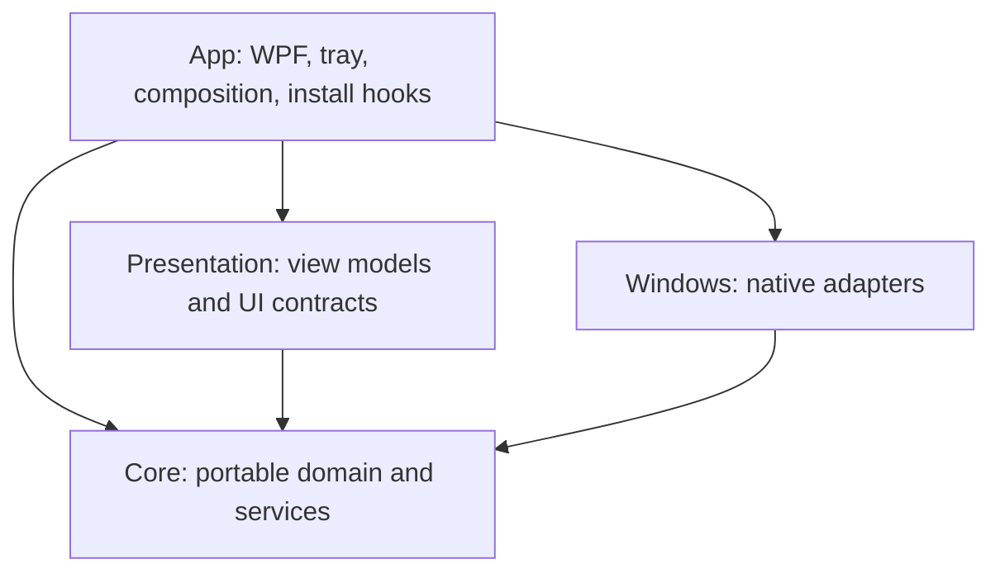

# Architecture and ownership

PrettyDesk has four production projects. Its reusable logic is separate from
Windows interop and the WPF shell. Keep this split when adding features.

| Project | Owns | Avoid putting here |
|---|---|---|
| [Core](../src/PrettyDesk.Core) | Detection rules, sessions, discovery parsers, rotation, rendering, catalog validation, content and persistence contracts | WPF, Win32 or shell window handles |
| [Presentation](../src/PrettyDesk.Presentation) | View models, resource strings, formatting, UI services and update policy | Native calls or concrete controls |
| [Windows](../src/PrettyDesk.Windows) | COM wallpaper application, backups, process queries, OS state/watchers, registry and native prompts | Business selection policy or WPF pages |
| [App](../src/PrettyDesk.App) | Composition, application lifetime, pages, appearance, tray, update backend and installer hooks | Portable rule/rotation logic |

The [source map](../src/README.md) routes individual tasks to files. Python art
tooling and the catalog-sign CLI are developer tools, not application runtime dependencies.

## Startup and shutdown

1. [Program.cs](../src/PrettyDesk.App/Program.cs) runs Velopack lifecycle hooks before
   normal startup, handles the conditional acceptance path, then enforces single instance.
2. [App.xaml.cs](../src/PrettyDesk.App/App.xaml.cs) owns WPF lifetime;
   [ServiceRegistration](../src/PrettyDesk.App/Composition/ServiceRegistration.cs)
   composes domain services, native adapters and view models.
3. [AppRuntime](../src/PrettyDesk.App/Composition/AppRuntime.cs) starts the UI/tray,
   then catalog loading, watchers, detection, wallpaper orchestration and prefetch.
4. Lifetime disposal stops workers and releases native resources. Wallpaper restoration
   uses the durable backup, including explicit uninstall hooks; verify lifecycle changes
   against the real restore and installation tests.

Acceptance-only paths are compiled conditionally. They use isolated data roots;
[package.ps1](../tools/package.ps1) verifies that distributable assemblies exclude them.

## Detection to wallpaper

```mermaid
flowchart LR
  Signals[Polling / foreground / Steam / deadline] --> Detection[DetectionService: serialized evaluation]
  Detection --> Matcher[RuleMatcher: candidates and limited details]
  Matcher --> Tracker[GameSessionTracker: debounce, exit grace, priority]
  Tracker --> Active[ActiveChanged]
  Active --> Orchestrator[WallpaperOrchestrator]
  Orchestrator --> Plan[ContextPlanner / rotation / variant selection]
  Plan --> Render[WallpaperRenderer / RenderCache]
  Render --> Native[DesktopWallpaperService: dedicated STA COM worker]
```

Detection is currently periodic even with an active game. A bounded coalescing
channel serializes evaluations. Process snapshots contain names/PIDs; detail queries
are limited to candidates. Session tracking applies startup debounce, exit grace and
foreground priority. Installed-game discovery is a separate read-only operation; an
installed entry is not proof the game is running or has an available wallpaper.

The orchestrator chooses game/default/preview contexts and rotation, and avoids
reapplying an unchanged selection. Rendering uses monitor geometry, aspect variants
and focal cropping. Before first application, the original desktop configuration
must be durably saved by [WallpaperBackupService](../src/PrettyDesk.Windows/WallpaperBackupService.cs).

## Catalog, content and persistence

- [CatalogService](../src/PrettyDesk.Core/Catalog/CatalogService.cs) verifies remote
  signatures before parsing, validates catalog structure and retains bundled/last-good
  fallback content. [CatalogSecurity](../src/PrettyDesk.Core/Catalog/CatalogSecurity.cs)
  contains public trust material, never private signing keys.
- [ContentLibrary](../src/PrettyDesk.Core/Content/ContentLibrary.cs),
  [FileDownloader](../src/PrettyDesk.Core/Content/FileDownloader.cs) and
  [PackStore](../src/PrettyDesk.Core/Content/PackStore.cs) handle content lookup,
  downloads and verified pack storage. [PrefetchCoordinator](../src/PrettyDesk.Core/Content/PrefetchCoordinator.cs)
  connects installed-game information to background acquisition policy.
- [SettingsService](../src/PrettyDesk.Core/Settings/SettingsService.cs),
  [AppStateService](../src/PrettyDesk.Core/Settings/AppStateService.cs) and
  [JsonFileStore](../src/PrettyDesk.Core/Settings/JsonFileStore.cs) own persisted
  preferences/state. [AppPaths](../src/PrettyDesk.App/AppPaths.cs) defines runtime locations.

Normal user data is under `%LOCALAPPDATA%/PrettyDesk`; Velopack installation is
under `%LOCALAPPDATA%/PrettyDeskApp`. Generated test and release outputs stay in
`TestResults` and `dist`. Private signing material lives outside the checkout.
See [content ownership](../content/README.md) before changing catalog hashes or bundles.

## Appearance boundaries

[AppAppearance](../src/PrettyDesk.App/Services/AppAppearance.cs) provides system
light/dark and high-contrast palettes; [Styles.xaml](../src/PrettyDesk.App/Resources/Styles.xaml)
and [Views](../src/PrettyDesk.App/Views) render the shell. Current wallpaper application
is static. Live clocks/visualizers need a separate desktop rendering lifecycle;
taskbar styling is a separate shell capability. Neither is implemented by this architecture.
