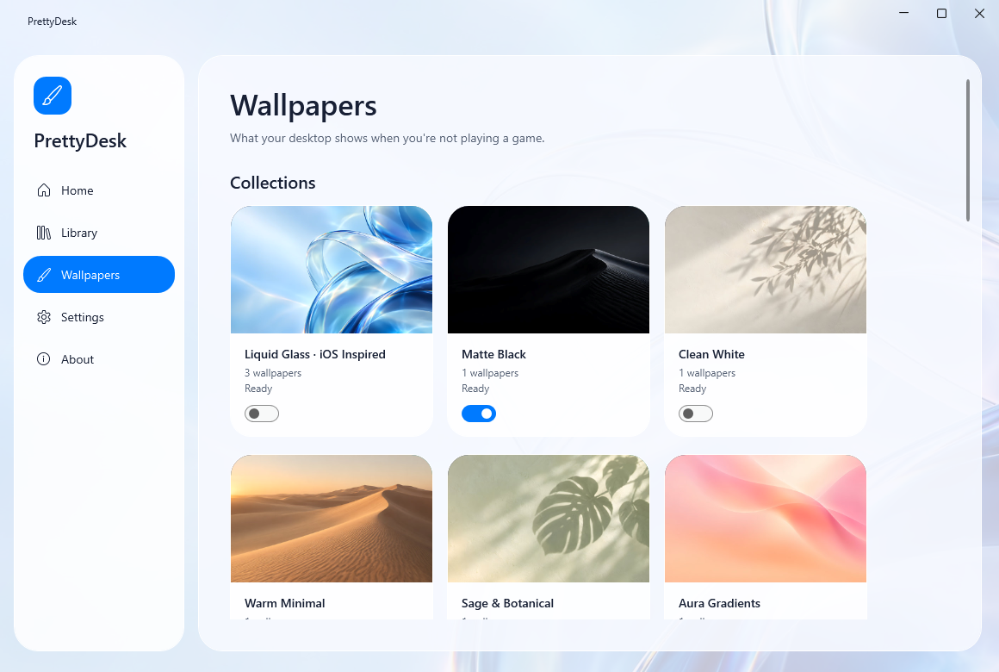
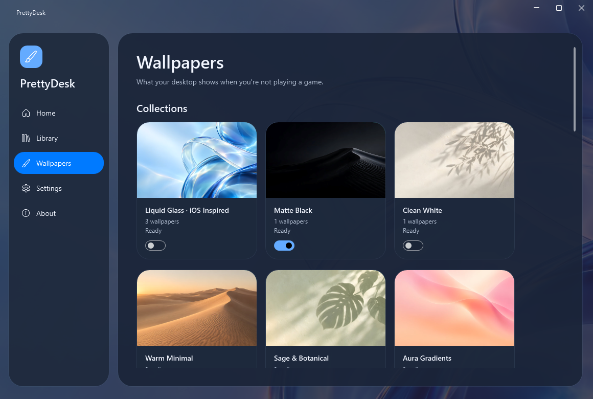

# Liquid Glass refresh

PrettyDesk now uses a floating top tab bar, translucent optical layers, 24–28 px rounded surfaces, clear typography,
blue capsule actions, and an image-forward wallpaper gallery. Library filters remain radio controls with a segmented presentation;
keyboard focus and the existing commands remain available. The Defaults destination is labeled Wallpapers.

The visual reference is [Apple's Liquid Glass guidance](https://developer.apple.com/documentation/TechnologyOverviews/liquid-glass).
This is an independent Windows interpretation with original artwork, Windows typography and native Windows window controls.
No Apple stock wallpaper, logos, or proprietary fonts are included. There is no continuous blur or ambient animation.
System light/dark changes update the palette; high contrast substitutes system surface/text brushes.

The new `default.ios-glass` collection is an intentionally smaller three-wallpaper capsule: Tide, Bloom and Dusk.
Each has separately generated and visually reviewed landscape, ultrawide and portrait masters. The pipeline produces six ratios
(3840×2160, 3840×2400, 3000×2000, 5120×2160, 5120×1440, 2160×3840) and a thumbnail for each.
The `bundled` tag includes all 18 variants in the offline installer. Tide remains the collection's single starter.
The complete starter bundle is 51.05 MiB, below the 60 MiB budget. Raw masters are upscaled by the existing Real-ESRGAN pipeline.

Validation on this Windows workstation:

| Check | Result |
|---|---|
| Release build | PASS, zero warnings/errors |
| Full .NET suite | PASS, 677 passed; one opt-in HTTPS fixture skipped |
| Asset pipeline tests | PASS, 71 passed |
| Catalog schema, offline file hashes and bundle size | PASS, 200 referenced assets |
| Real WPF views, shell, onboarding and bindings | PASS |
| Render inspection in light/dark at 1160×780 and minimum 860×560 | PASS |
| Native keyboard traversal, screen reader, high contrast, mixed DPI and 125–200% scaling | NOT RUN for this refresh |
| Updated performance soak and lower-end/ARM64 hardware | NOT RUN for this refresh; see PERF.md |

WPF captures are generated by setting `PRETTYDESK_UI_CAPTURE_DIR` and running AppSmokeTests. Images are actual WPF content renders;
native DWM effects and window shadows are outside that capture. The previous content-host, signing and hardware acceptance gaps remain
tracked in BACKLOG.md. The broader 289-wallpaper generation run is still incomplete.

